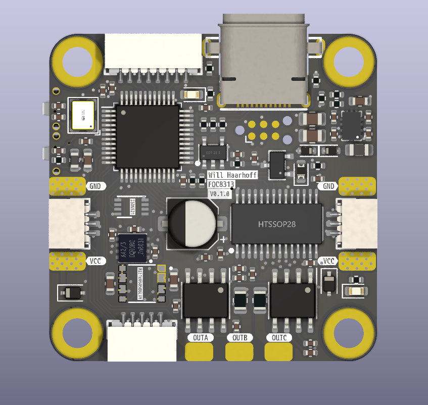

# foc8313
This board was inspired by [Foc-Ctrl-Lite](https://github.com/peng-zhihui/Ctrl-FOC-Lite). FOC8313 is a highly compact, feature rich, daisy-chainable,  field oriented control board based around the DRV8313 3 phase half bridge driver. This board is highly configurable and upgradeable, and includes all the manufacturing files required start producing controllers for $\approx$ $20/board
|Front|Back|
|--| --|
| | |

## Features:
 - Highly compact 35x35mm outline
 - 29x29 square M3 hole pattern
 - 12V to 35V operating range
 - 3.5A max per phase current
 - Onboard STM32F103CBTx microcontroller
 - Based on the DRV8313 3 phase half bridge driver
 - 2 x INA240A2D high side current sense amplifiers
 - 1 x AS5047D back mounted hall effect encoder
 - EEPROM to store configurations / calibrations etc. 
 - Daisy chainable power and CAN
 - Programmable with USB-DFU or StLink - 6 pin tag connect
 - Auxilliary encoder/Timer port with 5V and GND
 - Auxilliary SPI/GPIO and I2C/UART port with 5V and GND
 - Easily upgradable for isolated CAN (3 wire)
 - Extremely compact isolated CAN
 - JLC manufacturing files included
 - Cost optimised for PCBA with JLCPCB (as few extended components as possible)
 - Most basic variant costs $\approx$ $20 per board (for 10 PCBs at JLCPCB)
 - Predominantly single sided design allows for cost effective single sided PCBA, easy hot plating for rework, easy configuration with jumpers
  

| Top | In1 |
|--| --|
|||
|In2 | Bottom|
|||

# PCBA - Cost Scaling:
| Version | Colour | Finish | Assembly      | Quantity | Unit price | Extended Price |
| -----   | ----   | ------ | -----         | -----    | ----       | ------         |
| v1.0    | Black  | Enig   | Standard T&B  | 15       |$30.8       | $462.57        |
| v1.0    | Black  | Enig   | Standard Top  | 15       |$24.3       | $364.22        |
| v1.0    | Black  | HASL   | Standard Top  | 10       |$24.75      | $247.51        |
| v1.0    | Black  | Enig   | Standard T&B  | 100      |$16.78      | $1678.39       |
| v1.0    | Green  | HASL   | Economic Top  | 2        |$53.45      | $106.89        |
| v1.0    | Green  | HASL   | Economic Top  | 5        |$30.28      | $151.40        |
| v1.0    | Green  | HASL   | Economic Top  | 10       |$20.48      | $204.81        |
| v1.0    | Green  | HASL   | Economic Top  | 15       |$19.2       | $288.48        |
| v1.0    | Green  | HASL   | Economic Top  | 30       |$15.6       | $468.48        |
| v1.0    | Green  | HASL   | Standard Top  | 100      |$12.98      | $1297.77       |
| v1.0    | Black  | Enig   | No ICs Top    | 10       |$15.9 +     | $159.37        |
| v1.0    | Black  | Enig   | No ICs Top    | 15       |$12.9 +     | $193.44        |

# ICs:
15x @LCSC: 215.22 -> 14.33
10x @LCSC: 146.71 -> 14.6